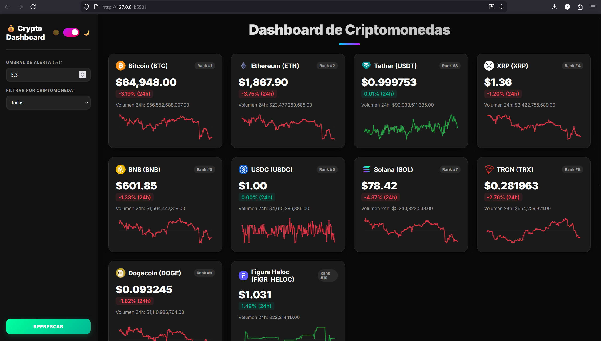

# 💰 Crypto Dashboard

Dashboard de criptomonedas en tiempo real con datos reales de la API de CoinGecko.

## 📸 Vista Previa



## 🚀 Características

- 📊 **Datos en tiempo real** - Precios, volumen, capitalización de mercado
- 📈 **Gráficos de tendencia** - Evolución de 7 días con Canvas
- 🌙 **Modo Claro/Oscuro** - Toggle para cambiar el tema
- ⚠️ **Alertas visuales** - Notificaciones cuando el precio cambia significativamente
- 🔄 **Actualización automática** - Datos actualizados cada minuto
- 📱 **100% Responsive** - Funciona en desktop y móvil
- 📚 **Guía para principiantes** - Explicaciones de términos de criptomonedas

## 🛠️ Tecnologías

- HTML5
- CSS3 (Moderno, con variables y animaciones)
- JavaScript Vanilla (Sin frameworks)
- API CoinGecko (Datos reales)

## 📁 Estructura

```
/index.html        - Estructura principal
/css/style.css     - Estilos del dashboard
/js/main.js        - Inicialización
/js/dashboard.js   - Lógica de API y componentes
/js/charts.js      - Gráficos Canvas
/js/utils.js       - Funciones auxiliares
/images/home.png   - Vista previa
```

## ⚙️ Configuración

- **Umbral de alertas**: Por defecto 5% (configurable en el sidebar)
- **Intervalo de actualización**: Por defecto 60 segundos (configurable)

## 👨‍💻 Desarrollado por Isaac Esteban Haro Torres

**Ingeniero en Sistemas · Full Stack · Automatización · Data**

- 📧 Email: zackharo1@gmail.com
- 📱 WhatsApp: 098805517
- 💻 GitHub: https://github.com/ieharo1
- 🌐 Portafolio: https://ieharo1.github.io/portafolio-isaac.haro/

---

© 2026 Isaac Esteban Haro Torres - Todos los derechos reservados.
